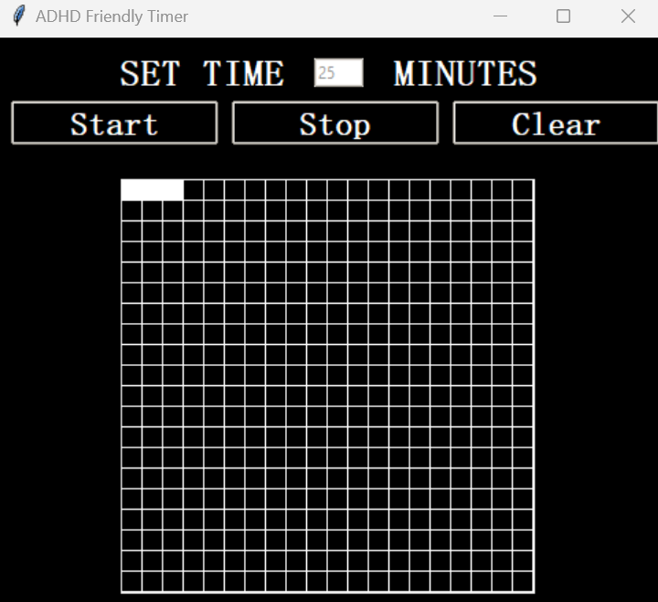

# ADHD Friendly Timer



## Overview

ADHD Friendly Timer is a simple desktop application built with Python and Tkinter. It helps users visualize the passage of time using a grid of mini-squares that gradually fill from black to white—making time easier to perceive for those with ADHD.

## Features

- **Visual Timer:** A grid (default 20x20) of mini-squares fills as time elapses.
- **Customizable Duration:** Set the timer in minutes (defaults to 25 minutes if left empty).
- **Control Buttons:**
  - **Start:** Begin or resume the timer.
  - **Stop:** Pause the timer.
  - **Clear:** Reset the timer and grid.
- **Modern UI:** Minimalistic dark-themed interface.

## Requirements

- Python 3.x (Tkinter is included)
- [Optional] PyInstaller (for creating an executable)

## Virtual Environment Setup

It's recommended to build and package this project within a Python virtual environment to minimize dependency conflicts.

1. **Create a Virtual Environment:**
   ```bash
   python -m venv venv
   ```
2. **Activate the Virtual Environment:**
   - On Windows:
     ```bash
     venv\Scripts\activate
     ```
   - On macOS/Linux:
     ```bash
     source venv/bin/activate
     ```
3. **Install Dependencies:**
   ```bash
   pip install pyinstaller
   ```

## Installation & Usage

1. **Clone the Repository:**
   ```bash
   git clone https://github.com/your-username/adhd-friendly-timer.git
   cd adhd-friendly-timer
   ```

2. **Run the Application:**
   ```bash
   python timer.py
   ```

## Packaging as an Executable

1. **Ensure you're in your virtual environment.**

2. **Install PyInstaller (if not already installed):**
   ```bash
   pip install pyinstaller
   ```

3. **Build the Executable:**
   ```bash
   pyinstaller --onefile --windowed timer.py
   ```


The generated executable will be located in the `dist` folder.

## License

This project is licensed under the MIT License.
